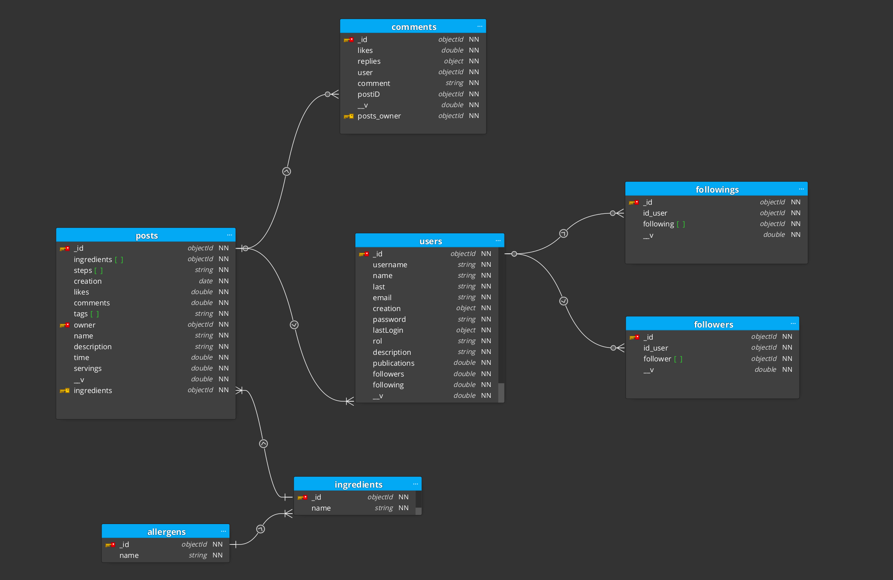

# Proyecto Instagram de Recetas: Backend

## MVP Diseño BBDD

### Modelo ER

## ENDPOINTS

### LOGIN

    POST    api/v1/users/login
    PUT     api/v1/users/password/reset

### REGISTER

    POST    api/v1/users/register

### HOME

    GET     api/v1/posts/public/popular

### TIMELINE

    GET     api/v1/users/{userID}/timeline

### RECETA-COMPLETA/PREVIEW

    GET     api/v1/posts/{PostID}
    POST    api/v1/posts/{postID}/like
    DELETE  api/v1/posts/{postID}/like
    POST    api/v1/posts/{postID}/comment
    PUT     api/v1/posts/{postID}/comment
    DELETE  api/v1/posts/{postID}/comment
    POST    api/v1/posts/{postID}/save
    DELETE  api/v1/posts/{postID}/save
    GET     api/v1/posts/tag/{tagID}
    POST    api/v1/comments/{commentID}/like
    DELETE  api/v1/comments/{commentID}/like

### PROFILE

    GET     api/v1/posts/{postID}/save
    POST    api/v1/{userID}/follow
    DELETE  api/v1/{userID}/follow
    GET     api/v1/users/{userID}/profile
    PUT     api/v1/users/{userID}/profile
    POST    api/v1/posts
    PUT     api/v1/posts/{postID}
    DELETE  api/v1/posts/{postID}

## Authors

[Imar Abreu Díaz](https://github.com/izm20)  
[Francisco Javier Mendoza Álvarez](https://github.com/PanchoMen)  
[Daniel Rodríguez Suárez](https://github.com/Danielmagox)
