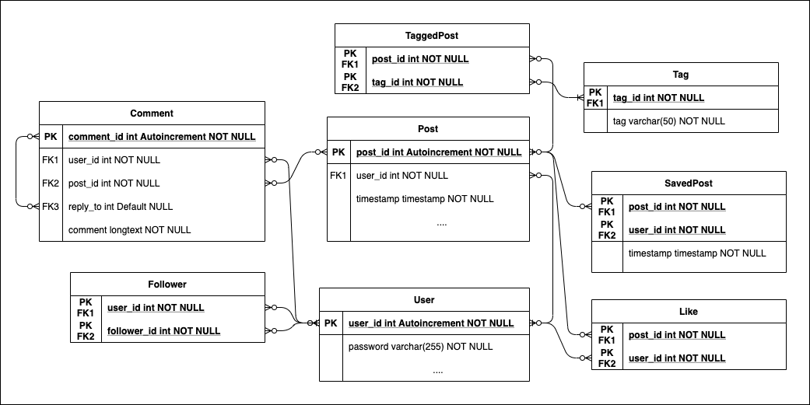

# Proyecto Instagram de Recetas: Backend

---

## MVP Diseño BBDD

### Modelo ER

## ENDPOINTS

### LOGIN:

    POST    api/v1/login
    PUT     api/v1/resetPassword/{userID}

### REGISTER:

    POST	api/v1/register

### HOME:

    GET     api/v1/publicPost

### TIMELINE:

    GET     api/v1/timeline/{userID}

### RECETA-COMPLETA/PREVIEW:

    GET		api/v1/post/{PostID}
    POST	api/v1/likePost/{postID}
    DELETE	api/v1/likePost/{postID}
    POST	api/v1/comment/{postID}
    PUT		api/v1/comment/{commentID}
    DELETE	api/v1/comment/{commentID}
    POST	api/v1/savePost/{postID}
    DELETE	api/v1/savePost/{postID}
    GET		api/v1/postByTag/{tagID}
    POST	api/v1/likeComment/{commentID}
    DELETE	api/v1/likeComment/{commentID}

### PROFILE:

    GET		api/v1/savedPosts/{userID}
    POST	api/v1/follow
    DELETE	api/v1/follow
    GET		api/v1/profile/{userID}
    PUT		api/v1/profile/{userID}
    POST	api/v1/post
    PUT		api/v1/post
    DELETE	api/v1/post

## Authors

[Imar Abreu Díaz](https://github.com/izm20)  
[Francisco Javier Mendoza Álvarez](https://github.com/PanchoMen)  
[Miqueas García González](https://github.com/Sozhia)  
[Daniel Rodríguez Suárez](https://github.com/Danielmagox)
